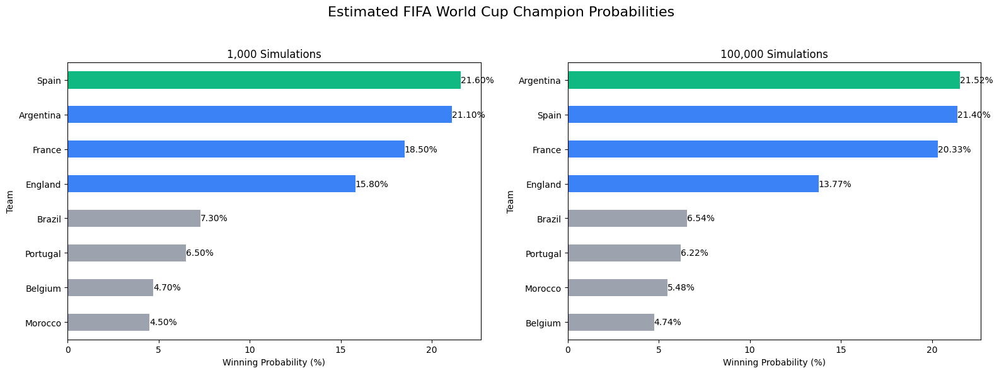
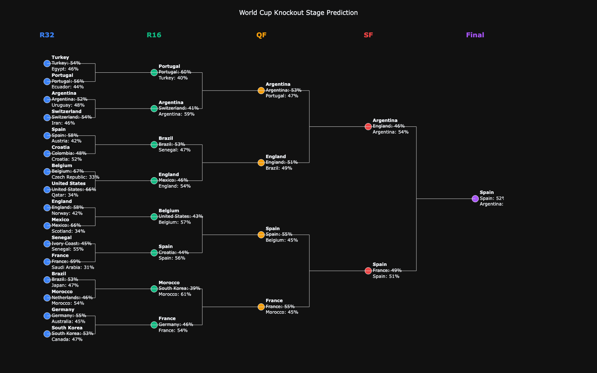

# ⚽ Sports Analytics Project
## FIFA World Cup 2026 Prediction Pipeline & Monte Carlo Simulation

## Summary

This project predicts match outcomes for the 2026 FIFA World Cup using machine learning and estimates each team's chance of winning the tournament through Monte Carlo simulation. Historical international match results, FIFA ranking points, and engineered team performance features were used to train an XGBoost classifier (ROC-AUC ≈ 0.76) before simulating the knockout stage thousands of times.

## Project Overview

The FIFA World Cup is the premier global football competition held every four years. The 2026 edition introduces a historic format expansion, increasing the field to 48 qualified nations competing across three host countries (Mexico, Canada, and the United States).

This project leverages machine learning and statistical modeling to simulate the FIFA World Cup and predict tournament outcomes. The pipeline is structured into four main phases:
- **Data Pipeline:** Data collection, data cleaning, target setting, and feature engineering.
- **Model Development:** Training predictive classification models to estimate match-level outcomes.
- **Tournament Logic:** Simulating full World Cup tournament structures (Group Stage through Finals).
- **Monte Carlo Engine:** Running thousands of stochastic simulations to map out team win probabilities and expected performance distributions.

## Key Achievements

- XGBoost achieved a ROC-AUC of approximately **0.76**.
- The model predicted a final between **Spain and Argentina**.
- Monte Carlo simulation consistently identified **Argentina, Spain, France, and England** as the strongest title contenders.
- Increasing the simulation from **1,000** to **100,000** iterations produced stable championship probability estimates.

## The 48-Team Tournament Structure
The expanded tournament format significantly alters traditional progression brackets:
* **The Group Stage (72 Matches):** Teams are split into 12 groups (Groups A through L) of 4 teams each.
* **The Wildcard Tiebreaker:** To form a clean single-elimination bracket, the tournament selects the top 2 teams from each of the 12 groups (24 teams) plus the 8 best third-place teams across the entire tournament based on points, goal differentials, and goals scored.
* **The Knockout Brackets:** These 32 surviving teams enter a single-elimination grid progressing sequentially:
$$\text{Round of 32} \longrightarrow \text{Round of 16} \longrightarrow \text{Quarter-Finals (QF)} \longrightarrow \text{Semi-Finals (SF)}\longrightarrow \text{Third-Place Match} \longrightarrow \text{World Cup Final}$$

## Data Sources & Collection

The project uses three datasets which were collected from Kaggle:

* **Historical Match Results (`results.csv`):** Historical international fixture logs containing match dates, teams, tournament tiers, neutral ground indicators, and final scores.
* **Historical FIFA Rankings (`fifa_ranking-2024-06-20.csv`):** Official tracking of team points and continental configurations up to June 20, 2024.
* **Pre-Tournament FIFA Rankings (`fifa_ranking_2026-06-08.csv`):** Baseline power matrices representing international standings right before tournament kickoff.

## Methodology & Notebook Workflow

The analysis is structured sequentially across the following core milestones:

### 1. Data Preprocessing & Harmonization
* **Scope Trimming:** Trimming international match data to 4-year competitive cycles to ensure current form relevance, filtering out non-qualifying teams, and engineering a binary classification target variable (`result`).
* **Schema Normalization:** Extensive data cleanup to align mismatched team schemas, naming conventions, and historical data gaps across multiple external sources.

### 2. Feature Engineering & Base Probabilities
Extracting critical parameters including ranking differentials, moving goal averages (overall vs. last 5 games), goals-conceded ratios, and friendly match indicators. 

Additionally, expected win probabilities ($E_A$) were established using the standard Elo rating formula:

$$E_A = \frac{1}{1 + 10^{(R_B - R_A)/400}}$$

*Where $R_A$ and $R_B$ represent the current numeric ratings of Team A and Team B, respectively.*

### 3. Model Training & Hyperparameter Tuning
* **Candidate Architectures:** GridSearchCV with cross-validation was implemented across three classification models: Random Forest, Gradient Boosting, and XGBoost.
* **Early Stopping Optimization:** To combat overfitting, early stopping criteria (`early_stopping_rounds=20`) tracking Area Under the ROC Curve (`eval_metric="auc"`) were integrated into the training loop, capturing the peak generalized state of the model.

## Model Evaluation & Selection

- **XGBoost Classifie**r was selected for final deployment. While all evaluated models yielded very similar performance, XGBoost demonstrated slightly better generalization and resistance to overfitting, achieving a final validation score of ROC-AUC $\approx 0.76$.

## Model Outputs & Results

### 1. Monte Carlo Simulation (Championship Probabilities)

The tournament was simulated using Monte Carlo methods to estimate each team's probability of winning the World Cup. With 1,000 simulations, Spain had the highest estimated championship probability (21.60%), narrowly ahead of Argentina (21.10%). After increasing the simulation to 100,000 iterations, Argentina became the slight favourite (21.52%), with Spain close behind (21.40%). The difference between the two teams was only 0.12 percentage points, indicating that they are effectively evenly matched. The larger simulation produced more stable estimates while consistently identifying Argentina, Spain, France, and England as the tournament's strongest contenders.

### 2. Single-Path Knockout Bracket Prediction (XGBoost)

In the deterministic single-bracket forecast, key knockout matchups yielded the following win margins:

* **Quarterfinals (QF):**
  * Argentina (53%) vs. Portugal (47%)
  * England (51%) vs. Brazil (49%)
  * Spain (55%) vs. Belgium (45%)
  * France (55%) vs. Morocco (45%)
* **Semifinals (SF):**
  * Argentina (54%) vs. England (46%)
  * Spain (51%) vs. France (49%)
* **Third-Place Match:**
  * **France (57%)** vs. England (43%)
* **World Cup Final:**
  * **Spain (52%)** vs. **Argentina (48%)**

### Model Convergence Analysis
Both the Monte Carlo simulation and XGBoost bracket predictions converge on the same top contenders:
* **Monte Carlo:** Identifies **Spain (21.60%)** and **Argentina (21.10%)** as the top two favorites, separated by just 0.50 percentage points.
* **XGBoost Bracket:** Predicts a final between **Spain** and **Argentina**, with Spain maintaining a close probability edge (52% vs. 48%) to take the title.

## Challenges & Limitations

### 1. Challenges
* **Data Harmonization over Modeling:** The main challenge lay in data preparation rather than algorithm design and cleaning inconsistent data formats, normalizing country naming variations, and resolving historical ranking gaps.
* **Manual Knockout Hardcoding:** Automating dynamic bracket progression for the expanded 48-team layout presented challenges due to non-standard third-place qualification paths, requiring manual coding for match assignments across knockout rounds.

### 2. Limitations
* **Static Ranking Assumption (2024–2026):** Granular, active tracking updates for 2024–2026 were unavailable programmatically; thus, static baseline rankings from June 2024 were held constant for intermediate fixtures prior to applying pre-tournament metrics.
* **Best Third-Place Rule ("Enzy Table"):** The complex 48-team best 3rd-place team lookup combination matrix was not dynamically simulated within the notebook loop. Instead, third-place advancing teams were mapped manually based on highest projected quality from available group draw assignments.
* **Binary Outcome vs. Penalty Shootouts:** The model is evaluated as a binary classifier ($0$ or $1$) representing regular/extra time outcomes, inherently missing the non-deterministic psychological factors of penalty shootouts.

## Future Enhancements

* **Dynamic Ranking Pipeline:** Build web scrapers to dynamically update real-time FIFA ranking metrics for post-2024 windows.
* **Automated Enzy Table Integration:** Fully automate the 12-group, 8-best-third-place tiebreaking algorithm directly into the simulation loop.
* **Player-Level Features:** Incorporate club-level player performance indicators (e.g., expected goals/xG, player market values, injuries, and squad depth).

## Tech Stack & Infrastructure

* **Data Manipulation & Math:** `pandas`, `numpy`
* **Machine Learning & Modeling:** `scikit-learn`, `xgboost`, `gradientboosting`, `randomforest`
* **Simulation & Optimization:** `Monte Carlo Simulations`, `GridSearchCV`
* **Visualization:** `matplotlib`, `seaborn`