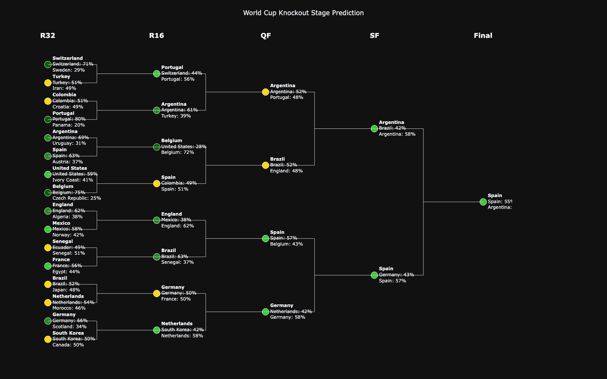
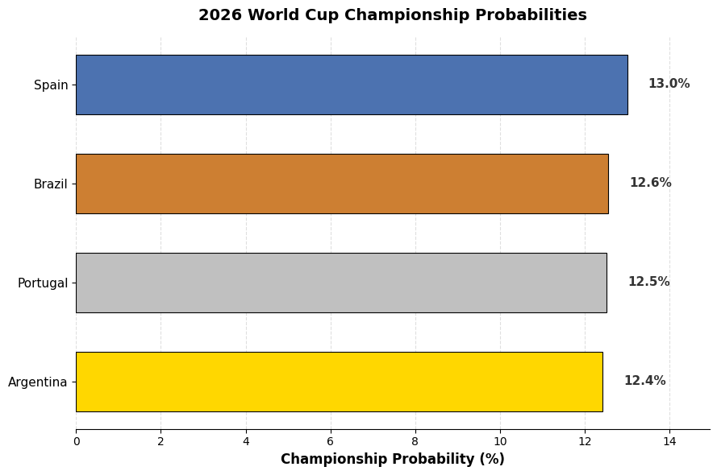

# 🏆 Predicting the 2026 FIFA World Cup

An end-to-end data science and machine learning project designed to forecast match outcomes and simulate tournament variations for the expanded **2026 FIFA World Cup**, tracking progression from the group stages to the final match.

---

## 📌 Project Overview
The FIFA World Cup is the premier global football competition held every four years. The 2026 edition introduces a historic format expansion, increasing the field to **48 qualified nations** competing across three host countries (Mexico, Canada, and the United States). 

This project leverages historical international football data, engineering robust predictive features to build an optimized machine learning pipeline capable of simulating thousands of tournament iterations to determine precise team championship probabilities.

### ⚙️ The 48-Team Tournament Structure
The expanded tournament format significantly alters traditional progression brackets:
* **The Group Stage (72 Matches):** Teams are split into **12 groups (Groups A through L)** of 4 teams each.
* **The Wildcard Tiebreaker:** To form a clean single-elimination bracket, the tournament selects the **top 2 teams from each of the 12 groups** (24 teams) plus the **8 best third-place teams** across the entire tournament based on points, goal differentials, and goals scored.
* **The Knockout Brackets:** These 32 surviving teams enter a single-elimination grid progressing sequentially:
  $$\text{Round of 32} \longrightarrow \text{Round of 16} \longrightarrow \text{Quarter-Finals (QF)} \longrightarrow \text{Semi-Finals (SF)} \longrightarrow \text{World Cup Final}$$

---

## 📊 Data Sources & Collection
The modeling pipeline integrates three public datasets sourced from Kaggle:

1. **Historical Match Results (`results.csv`):** Historical international fixture logs containing match dates, teams, tournament tiers, neutral ground indicators, and final scores.
2. **Historical FIFA Rankings (`fifa_ranking-2024-06-20.csv`):** Official tracking of team points and continental configurations up to June 20, 2024.
3. **Pre-Tournament FIFA Rankings (`fifa_ranking_2026-06-08.csv`):** Baseline power matrices representing final international standings right before the tournament kickoff.

### ⚠️ Data Limitation & Scope Handling
The `fifa_ranking_2026-06-08` dataset provides a static baseline ranking specifically mapped for the tournament entry rather than an active day-to-day chronological timeline. To manage this constraint, matches played between late 2024 and early 2026 utilize the static June 2024 baseline parameters before updating to the active pre-tournament metrics. This represents an accepted baseline assumption within the predictive scope of this project.

---

## 🧠 Methodology & Notebook Workflow
The analysis is structured sequentially across the following core milestones:

1. **Data Preprocessing & Scope Limiting:** Trimming the international match data window to 4-year competitive cycles to ensure current form relevance, filtering out non-qualifying teams, and engineering a binary classification target variable (`result`).
2. **Feature Engineering:** Extracting 10 critical parameters, including ranking differentials, moving goal averages (overall vs. last 5 games), goals-conceded ratios, and friendly match indicators. Feature distributions were validated using violin plots.
3. **Model Development & Hyperparameter Tuning:** Running a robust training routine with a Train-Test split. `GridSearchCV` with cross-validation was implemented across multiple classification architectures (Random Forest, Gradient Boosting, and XGBoost).
4. **Early Stopping Optimization:** To combat overfitting, early stopping criteria (`early_stopping_rounds=20`) tracking Area Under the ROC Curve (`eval_metric="auc"`) were integrated into the training loop, capturing the peak generalized state of the model.

---

## 📈 Model Evaluation
* **Top Architecture:** **XGBoost Classifier** outperformed the alternative architectures, displaying the highest Area Under the Curve (AUC) score.
* **Regularization Success:** Early stopping successfully terminated training around tree 83, locking in the model's finalized state at **Tree 63** where test performance peaked before stalling, preserving a healthy generalization balance (Test AUC $\approx$ 0.77).

---

## 🔮 Model Ouput

### Classification model output (XGB)

### Monte Carlo simulation result
With 100,000 simulated tournaments, the Law of Large Numbers ensures these probability estimates have converged and aren't just sampling noise. Spain comes out on top with a 13.0% championship probability, narrowly ahead of Brazil (12.6%), Portugal (12.5%), and Argentina (12.4%). The tight clustering across the top four suggests no clear favorite for the 2026 tournament.

. 

---
  
## Tactical Analysis of the Finalists

### Spain
Across the Monte Carlo simulation (100,000 trials), Spain recorded the highest championship probability at 13.0%. In the XGBoost bracket prediction, Spain's path to the final shows a pattern of **narrow win margins at every stage**:
- R32: Spain 63% vs. Austria 37%
- R16: Spain 51% vs. Colombia 49%
- QF: Spain 57% vs. Belgium 43%
- Final: Spain 55% vs. Argentina 45%

The consistency of close-but-favorable margins (all between 51–63%) suggests the model views Spain as a **stable favorite in every round**, without ever facing a match where it is the underdog. Spain is the only finalist projected to hold a probability edge in all four knockout rounds.

### Argentina
Argentina also ranks in the Monte Carlo top four at 12.4% championship probability, close behind Spain, Brazil, and Portugal. In the XGBoost bracket, Argentina's path shows a **tighter and more variable set of margins**:
- R32: Argentina 69% vs. Uruguay 31%
- R16: Argentina 61% vs. Turkey 39%
- QF: Argentina 52% vs. Portugal 48%
- SF: Argentina 58% vs. Brazil 42%
- Final: Argentina 45% vs. Spain 55%

Argentina's margins start strong (69%, 61%) but compress significantly by the QF and SF (52%, 58%), and the model finally favors Spain over Argentina in the final. This suggests the model sees Argentina's path as **progressively harder**, culminating in the final as the only match where Argentina is the underdog.

### Model Agreement
Both models point to the same two teams as the top contenders:
- **Monte Carlo**: Spain (13.0%) and Argentina (12.4%) both place in the top four, separated by only 0.6 percentage points.
- **XGBoost**: Spain and Argentina are the two teams that reach the final, with the model favoring Spain by a 10-point margin (55% vs. 45%).

### Conclusion
Both models converge on **Spain as the marginal favorite and Argentina as the closest challenger**, but arrive at this conclusion through different lenses: Monte Carlo shows this as a near-even probability across the full distribution of outcomes (13.0% vs. 12.4%), while XGBoost shows it as a single deterministic path where Spain wins every round including a close final. The consistency of Spain's win margins across all rounds in the XGBoost model, paired with its top Monte Carlo probability, provides convergent though not conclusive, evidence that Spain holds a slight structural edge over Argentina in this year's tournament projection.

---

### Project Limitations

#### A. Static Ranking Assumption (The "Time Gap" Bug)

* **The Issue:** The `fifa_ranking_2026-06-08` dataset only gave a single snapshot of team ranks right before the tournament started. It did not have active tracking dates for the period between late 2024 and early 2026.
* **The Workaround:** For matches played in that mid-period, the code had to hold the June 2024 FIFA rankings completely static and unchanging.
* **The Impact:** In the real world, teams fluctuate in rank every single month based on friendly matches and qualifiers. Freezing the data introduces a slight tracking bias, meaning a team that got hot in late 2025 might look weaker to the model than they actually were.

#### B. Binary Outcome vs. Extra Time/Penalties

* **The Issue:** The model is built as a binary classifier (`result: 0 or 1`), calculating clean wins or losses based on regular-time statistics.
* **The Impact:** In actual tournament knockout rounds, many matches end in draws and transition into 30 minutes of Extra Time or a high-variance Penalty Shootout. The match simulation handles draws via probability averages rather than simulating the psychological stress of a penalty shootout, which adds an element of unpredictable real-world variance that data cannot fully capture.

---

## Potential imporvement to increase model performance

Advanced Player-Level Analytics (Expected Goals & Form). 

**The Upgrade:** Integrate external club-level performance metrics (e.g., xG, progressive passes, recent minutes played) for the top 23 players on each international roster.

**The Impact:** Team strength would dynamically shift if a superstar player (like Kylian Mbappé for France or Lamine Yamal for Spain) suffers a simulated injury or enters the tournament in peak scoring form, moving beyond purely team-level historical results.

---

## 🛠️ Tech Stack & Infrastructure
* **Data Manipulation & Math:** `pandas`, `numpy`
* **Machine Learning:** `scikit-learn`, `xgboost`, `gradientboosting`, `randomforest`
* **Visualization:** `matplotlib`, `seaborn`
* **Optimization:** `GridSearchCV`, `logloss`